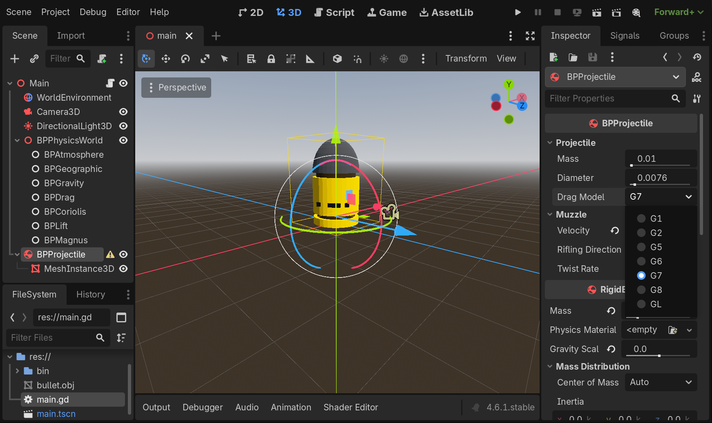

    

  <strong>for</strong>

    

A GDExtension for Godot 4.6 that integrates the [BulletPhysics](https://github.com/admtrv/BulletPhysics) library into the game engine, making it possible to build ballistic simulations visually in the Godot editor. The repository also includes a demo project with an example scene in `project/`.

    

